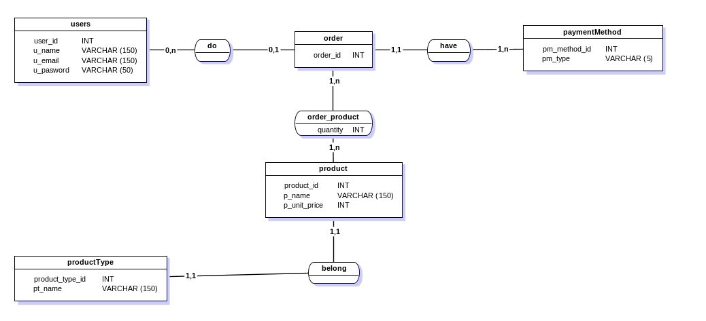

# <H1 style="color: blue; text-align:center; "> TD Final - Données1</h1>

## Exo 1 : Fonctions d'agrégation

#### 1. Création de base de données

```
    CREATE DATABASE e_commerce;
```

#### 2. Connexion à la base de données

```
    \c e_commerce;
```

#### 3. Création de table pour les utilisateurs

```
    CREATE TABLE users(
        user_id int primary key,
        u_name varchar(150),
        u_email varchar(150),
        u_password varchar(50)
    );
```

#### 4. Création de table pour les méthodes payement

```
    CREATE TABLE paymentMethod(
        pm_method_id int primary key,
        pm_type varchar(150) not null
    );
```

#### 5. Création de table pour les commandes

```
    CREATE TABLE "order"(
        order_id int primary key,
        user_id int references users(user_id),
        pm_method_id int references paymentMethod(pm_method_id),
        order_ispayed boolean,
        order_date DATE DEFAULT CURRENT_DATE
    );
```

#### 6. Création de table pours les types des produits

```
    CREATE TABLE productType(
        product_type_id int primary key,
        pt_name varchar(150)
    );
```

#### 7. Création de table pour les produits

```
    CREATE TABLE product(
        product_id int primary key,
        p_name varchar(150),
        p_unit_price int not null,
        product_type_id int references productType(product_type_id)
    );
```

#### 8. Création de table pour les commandes

```
    CREATE TABLE order_product(
        order_id int references "order"(order_id),
        product_id int references product(product_id),
        quantity int not null
    );
```

#### 1. MCD



#### 2. Insertion des données

##### 2.1 Méthodes de payment

```
    INSERT INTO
        paymentMethod
    VALUES
        (1, 'MVola'),(2,'Orange Money'),(3,'Airtel Money');
```

##### 2.2 Utilisateurs

```
    INSERT INTO
        users
    VALUES
        (1, 'Rakoto','rakoto@gmail.com','rakoto123');
```

##### 2.3 Type des produits

```
    INSERT INTO
        productType
    VALUES
        (1,'electromenager'),(2,'informatique'),(3,'vetements'),(4,'nourriture');
```

##### 2.4 Les produits

```
    INSERT INTO
        product
    VALUES
        (1,'ordinateur',400000,2),(2,'tee-shirt',10000,3),(3,'yaourt',1000,4),
        (4,'souris',20000,2),(5,'pull',15000,3),(6,'jus',5000,4);
```

##### 2.4 Insertion de la première commande de Rakoto

```
    INSERT INTO
        "order"
    VALUES
        (1,1,1,'true');

    INSERT INTO
        order_product
    VALUES
        (1,3,5);
```

##### Afficher tous les commandes effectués avec les utilisateurs

```
    SELECT
        users.u_name,
        paymentMethod.pm_type,
        product.p_name,
        order_product.quantity FROM users
    JOIN
        "order"
    ON
        users.user_id = "order".order_id
    JOIN
        paymentMethod
    ON
        paymentMethod.pm_method_id = "order".pm_method_id
    JOIN
        order_product
    ON
        order_product.order_id = "order".order_id
    JOIN
        product
    ON
        order_product.product_id = product.product_id;
```

#### 3.a Afficher les nombres produits

```
    SELECT
        COUNT(*) AS num_product
    FROM
        product;
```

#### 3.b Afficher les prix unitaire le moins cher et le plus cher dans chaque type de produit

```
    SELECT
        MIN(product.p_unit_price) AS min_price,
        MAX(product.p_unit_price) AS max_price,
        productType.pt_name AS product_type
    FROM
        product
    JOIN
        productType
    ON
        product.product_type_id = productType.product_type_id
    GROUP BY
        pt_name;
```

#### 3.c Afficher chaque commande effectué par Rakoto et le prix total payé par commande

```
    SELECT
        "order".order_id,
        SUM(order_product.quantity*product.p_unit_price)
    FROM
        "order"
    JOIN
        order_product
    ON
        order_product.order_id =  "order".order_id
    JOIN
        product
    ON
        product.product_id = order_product.product_id
    JOIN
        users
    ON
        users.user_id =  "order".user_id
    WHERE
        users.u_name =  'Rakoto'
    GROUP BY
        "order".order_id;
```

#### 3.d Afficher les produits le plus vendues

```
    SELECT
        product.p_name,
        SUM(order_product.quantity) AS total FROM order_product
    JOIN
        product
    ON
        product.product_id = order_product.product_id
    GROUP BY
        product.p_name
    ORDER BY
        total DESC;
```

#### 3.e Le revenu annuelle

```
    SELECT
        SUM(order_product.quantity * product.p_unit_price) AS revenue_annuelle,
        EXTRACT(YEAR FROM(CURRENT_DATE)) AS "Year" FROM product
    JOIN
        order_product
    ON
        order_product.product_id = product.product_id
    JOIN
        "order"
    ON
        "order".order_id = order_product.order_id
    WHERE
        "order".order_ispayed = 'true'
    AND
        EXTRACT(YEAR FROM ("order".order_date)) = EXTRACT(YEAR FROM(CURRENT_DATE));
```

## Exo 2 : Vues et index basiques

#### 1. Création de base données
```
    CREATE DATABASE social_network;
```
#### 2. Connexion à la base de donnée
```
    \c social_network;
```
#### 3. Création de table pour les utilisateurs
```
    CREATE TABLE "user" (
        user_id SERIAL PRIMARY KEY,
        first_name VARCHAR(50),
        last_name VARCHAR(50),
        birth_date DATE,
        email VARCHAR(100) UNIQUE
    );
```
#### 4. Création de table pour les posts
```
    CREATE TABLE "post" (
        post_id SERIAL PRIMARY KEY,
        user_id INT REFERENCES "user"(user_id),
        content TEXT,
        post_date TIMESTAMP DEFAULT CURRENT_TIMESTAMP
    );
```
#### 5. Création d'index pour les noms des utilisateurs
```
    CREATE INDEX user_first_name ON "user"(first_name);
```
#### 6. Création de view pour les lists des utilisateurs contenant seulement nom, prénom, âge, e-mail, et le nombre de post posté
```
CREATE VIEW 
    user_list AS 
SELECT 
    "user".user_id,
    "user".first_name,
    "user".last_name,
    DATE_PART('year', AGE("user".birth_date)) AS age,
    "user".email,
    COUNT("post".post_id) AS post_count
FROM 
    "user"
INNER JOIN 
    "post" ON "user".user_id = "post".user_id
GROUP BY 
    "user".user_id;
```
#### 7. Afficher la liste des utilisateurs qui ont moins de 20 ans et qui ont déjà posté en utilisant "VIEWS"
```
SELECT 
    *
FROM 
    user_list
WHERE 
    age < 20 AND post_count > 0;
```
#### 8. Afficher la liste des utilisateurs qui ont moins de 20 ans qui ont déjà posté sans utilisé "VIEWS"
```
SELECT 
    "user".user_id, 
    "user".first_name,
    "user".last_name, 
    "user".email, 
    COUNT("post".post_id) AS post_count  
FROM 
    "user" 
JOIN 
    "post" 
ON 
    "user".user_id = "post".post_id
GROUP BY 
    "user".user_id
HAVING 
    DATE_PART('year', AGE("user".birth_date)) < 20 AND COUNT("post".post_id)>0;
```

### Group SOAM
* Tsilavina Andriamiharison STD23100
* Freddy Andriamanohiniaina STD23097
* Nomena Randrianirina STD23033
* Vaninah Andrivololontiana STD23042